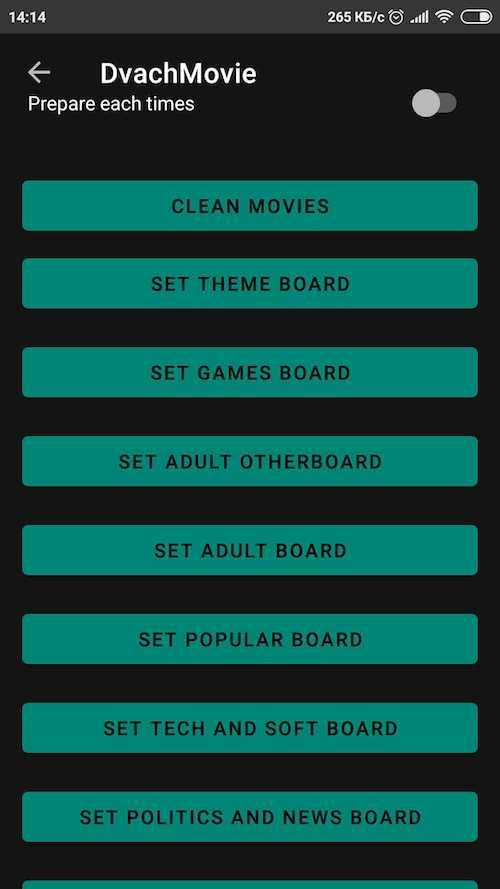

# DvachMovie
Player for videos from 2ch.hk

It has never been so easy to play movies from 2сh!
This app is based on MVVM architecture.
You'll watch only new webm from different boards. 
Also you can download videos. 

Screenshots
-----------

Libraries Used
--------------
* Foundation - Components for core system capabilities, Kotlin extensions and support for
  multidex and automated testing.
  * [AndroidX][1] - AndroidX is the open-source project that the Android team uses to develop, 
  test, package, version and release libraries within Jetpack.
  * [AppCompat][2] - Degrade gracefully on older versions of Android.
  * [Android KTX][3] - Write more concise, idiomatic Kotlin code.
* Architecture - A collection of libraries that help you design robust, testable, and
  maintainable apps. Start with classes for managing your UI component lifecycle and handling data
  persistence.
  * [Data Binding][101] - Declaratively bind observable data to UI elements.
  * [ViewModel][102] - Store UI-related data that isn't destroyed on app rotations. Easily schedule
     asynchronous tasks for optimal execution.
  * [Shared Preferences][103] - Save key-value data.
  * [Lifecycles][104] - Create a UI that automatically responds to lifecycle events.
  * [LiveData][105] - Build data objects that notify views when the underlying database changes.
  * [Navigation][106] - Handle everything needed for in-app navigation.
  * [Room][107] - Access your app's SQLite database with in-app objects and compile-time checks.
  * [WorkManager][108] - Manage your Android background jobs.
  * [Dagger][109] - Dagger is a fully static, compile-time dependency injection framework 
  for both Java and Android. 
  * [Coroutines][110] - Coroutines is a new way of writing asynchronous, non-blocking code. 
* UI - Details on why and how to use UI Components in your apps - together or separate
  * [Fragment][21] - A basic unit of composable UI.
  * [Layout][22] - Lay out widgets using different algorithms. 
  * [Material Design][23] - Material design is a comprehensive guide for visual, motion, 
  and interaction design across platforms and devices. 
  * [Constraint layout][24] - ConstraintLayout allows you to create large and complex 
  layouts with a flat view hierarchy (no nested view groups).
  * [ExoPlayer][25] - It provides an alternative to Android’s MediaPlayer API for 
  playing audio and video both locally and over the Internet.
  * [Animations & Transitions][26] - Move widgets and transition between screens.
* Third party
  * [Detekt][31] - Static code analysis for Kotlin.
  * [Glide][32] - For image loading and for glide transformations.
  * [Glide Transformations][33] - An Android transformation library providing 
  a variety of image transformations for Glide.
  * [Retrofit][35] - A type-safe HTTP client for Android and Java.
  * [Gson][36] - A Java serialization/deserialization library to convert Java Objects 
  into JSON and back.
  * [Timber][37] - A logging utility class built on top of Android's Log class.
  
[1]: https://developer.android.com/jetpack/androidx/
[2]: https://developer.android.com/topic/libraries/support-library/packages#v7-appcompat/
[3]: https://developer.android.com/kotlin/ktx

[101]: https://developer.android.com/topic/libraries/data-binding/
[102]: https://developer.android.com/topic/libraries/architecture/viewmodel/
[103]: https://developer.android.com/training/data-storage/shared-preferences/
[104]: https://developer.android.com/topic/libraries/architecture/lifecycle/
[105]: https://developer.android.com/topic/libraries/architecture/livedata/
[106]: https://developer.android.com/topic/libraries/architecture/navigation/
[107]: https://developer.android.com/topic/libraries/architecture/room/
[108]: https://developer.android.com/topic/libraries/architecture/workmanager/
[109]: https://google.github.io/dagger/
[110]: https://kotlinlang.org/docs/reference/coroutines-overview.html

[21]: https://developer.android.com/guide/components/fragments/
[22]: https://developer.android.com/guide/topics/ui/declaring-layout/
[23]: https://developer.android.com/guide/topics/ui/look-and-feel/
[24]: https://developer.android.com/training/constraint-layout/
[25]: https://developer.android.com/guide/topics/media/exoplayer/
[26]: https://developer.android.com/training/animation/

[31]: https://github.com/arturbosch/detekt
[32]: https://bumptech.github.io/glide/
[33]: https://github.com/wasabeef/glide-transformations/
[35]: https://square.github.io/retrofit/
[36]: https://github.com/google/gson/
[37]: https://github.com/JakeWharton/timber

License
-------

Copyright 2019 Alexander Fomenko.

Licensed to the Apache Software Foundation (ASF) under one or more contributor
license agreements.  See the NOTICE file distributed with this work for
additional information regarding copyright ownership.  The ASF licenses this
file to you under the Apache License, Version 2.0 (the "License"); you may not
use this file except in compliance with the License.  You may obtain a copy of
the License at

   http://www.apache.org/licenses/LICENSE-2.0

Unless required by applicable law or agreed to in writing, software
distributed under the License is distributed on an "AS IS" BASIS,
WITHOUT WARRANTIES OR CONDITIONS OF ANY KIND, either express or implied.
See the License for the specific language governing permissions and
limitations under the License.
